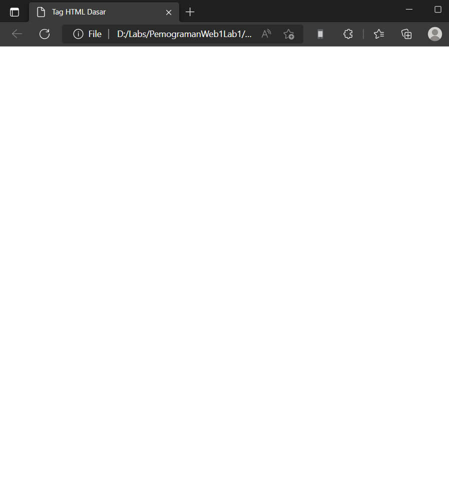
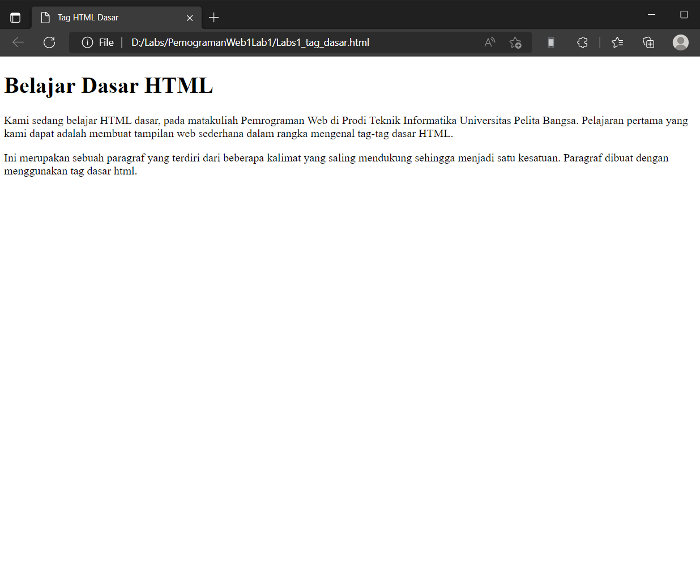
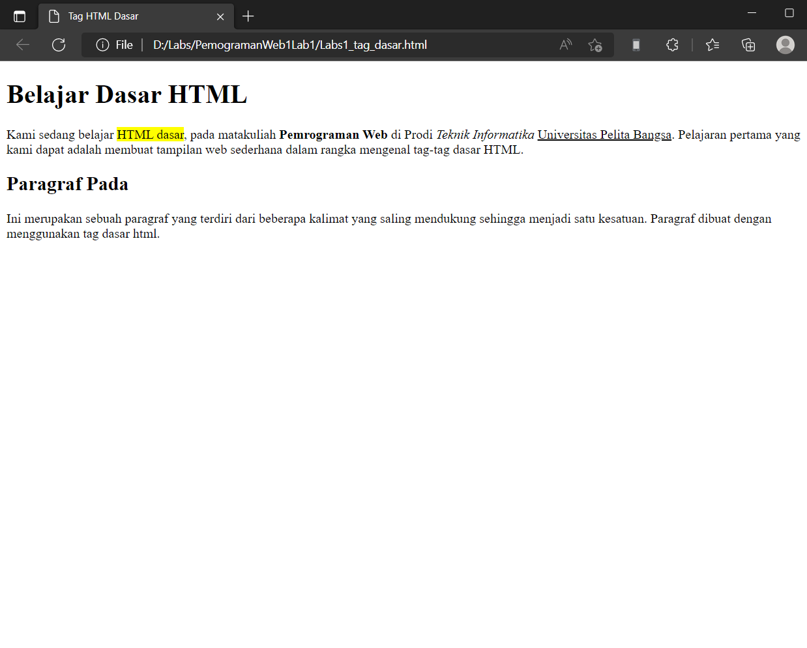
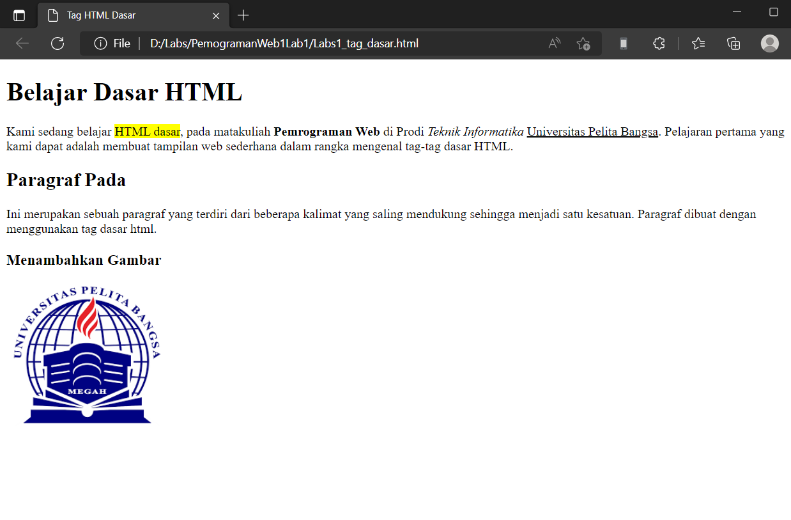
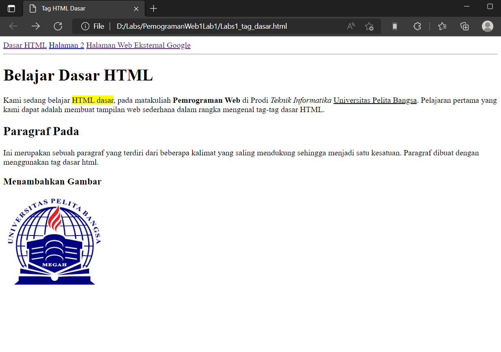

# PemogramanWeb1Lab1
## Belajar Tag Dasar HTML

### Memrubah Title pada HTML
Kode tag untuk title adalah `<title>Tag HTML Dasar</title>`
ini adalah tampilannya

### Membuat Paragraf
kode tag untuk paragraf adalah `
`
ini adalah tampilannya

### Menambahkan Judul
kode tag untuk judul adalah `<h1> sampai <h6>`
ini adalah tampilannya

### Memformat teks
kode tag untuk memformat teks adalah `<b> untuk format teks bold/ tebal , <i> untuk format teks italic/miring, <u> untuk format teks underline/garis bawah, <mark> untuk format teks yang berwarna`

ini adalah tampilannya

### Menyisipkan Gambar
kode tag untuk menyisipkan gambar adalah 
` di tag ini dipakai untuk menyisipkan gambar dengan menggunakan ukuran (width) 200px dan memberikan keterangan gambar (title)`

ini adalah tampilannya
 

### Menambahkan Hyperlink
kode tag untuk menambahkan hyperlink adalah 

`<!-- menambahkan link navigasi --> `
`<nav>`
    `<a href="lab1_tag_dasar.html">Dasar HTML</a>`
    `<a href="lab1_halaman2.html">Halaman 2</a>`
   ` <a href="http://www.google.com">Halaman Web Eksternal Google</a>`
`</nav>`
`
 ` 

ini adalah tampilannya

