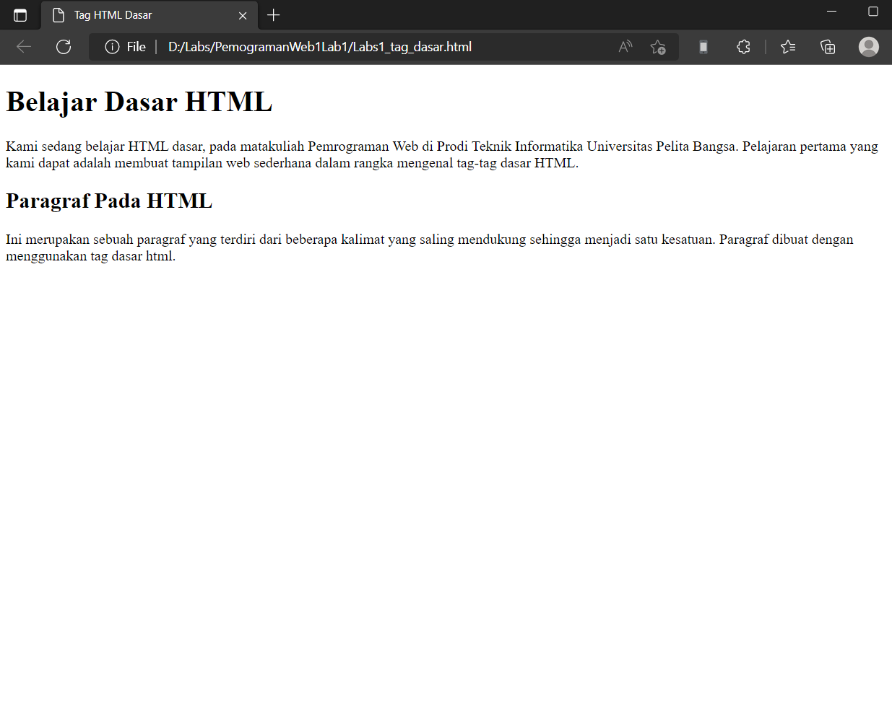

# PemogramanWeb1Lab1
## Belajar Tag Dasar HTML

### Membuat Paragraf
kode tag untuk paragraf adalah `
`
ini adalah tampilannya

#### Menambahkan Judul
kode tag untuk judul adalah `<h1> sampai <h6>`
ini adalah tampilannya

